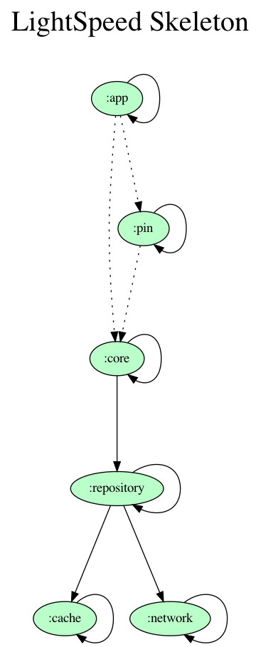

# TODO - Update all according to your needs, don´t keep this unchanged

# Project name

Introduction of the project.

`Url to website`

## Team

* **Name Surname** - work position

## Technologies

* App is completely written in ***Kotlin***
* App is completely reactive (we use ***coroutines*** and ***flow***)
* For API communication, this app uses ***REST API***, specifically Retrofit and OkHttp3 SDK libraries for Android
* App uses ***MVVM*** architecture
* App uses ***App Distribution*** from Firebase to distribute app to testers
* App respects ***Material design***, don´t use anything from old Appcompat libraries unless you absolutely have to

## App and project settings

* App supports only ***portrait mode*** (no landscape or tablets)

## Used features

* Camera
* Fingerprint

## Used libraries

* **Apollo SDK** - library supporting GraphQL
* **Retrofit** - network library
* **CameraX**
* **Coil** - Coroutine image loader
* **Crypto** - encrypting shared preferences and files
* **Koin** - dependency injection
* **Moshi** - parsing json
* **Navigation Components**
* **Room** - database
* **Stetho** - Chrome debug bridge
* **Timber** - logging
* **Java Time** - handling time

## Build variants

Use the Android Studio *Build Variants* button to choose from flavors:

* **development** - development server
* **staging** - staging server
* **production** - production server combined with debug and release build types.

## Keystore

Upload keystore is in our company drive under folder `project folder`. Release key is stored on Google servers. CI handles creating apks and aabs with correct keystore. More about keystores is
here [Show me](https://cleevio.atlassian.net/wiki/spaces/CLEEV/pages/479232005/Certs+hashes).

## CI

There are few possibilities, how CI reacts to new commit:

* If you commit with TAG containing `v.*`, CI creates production aab signed by **production** keystore.

* If you commit with TAG containing `v.+-dev.*`, CI creates development apk without sign which uploads to App Distribution.
* If you commit with TAG containing `v.+-devRelease.*`, CI creates development apk signed by **production** keystore which uploads to App Distribution.

* If you commit with TAG containing `v.+-stageDebug.*`, CI creates staging apk without sign which uploads to App Distribution.
* If you commit with TAG containing `v.+-stage.*`, CI creates staging apk signed by **production** keystore which uploads to App Distribution.

* If you commit with TAG containing `v.+-prodDebug.*`, CI creates production apk without sign which uploads to App Distribution.
* If you commit with TAG containing `v.+-prodRelease.*`, CI creates production apk signed by **production** keystore which uploads to App Distribution.

* Otherwise it just validates the build
* Also when apk is uploaded to App Distribution, Slack will send message to channel `#project_name`

## Localizations

Localizations are available at [Google Sheet](https://docs.google.com/spreadsheets/d/1w3jnLhyxuO0ImeOjl1ZsjpzmWhYkIcXA9st94jzBmNk/edit#gid=0)

For download strings use [Spreadsheet Localizer](https://plugins.jetbrains.com/plugin/11159-spreadsheet-localizer/).

Configuration file is `localization.json`

Follow instructions here: [String resources from Google Sheet](https://cleevio.atlassian.net/wiki/spaces/CLEEV/pages/1584267265/String+resources+from+Google+Sheet)

## Detekt + KTLint

It is necessary to add newly created module paths to build.gradle for detekt input files.

- Configuration file is 'detekt.yml'

## Module graph

To update graph use:

- Install (if you haven't installed yet) [Graphviz](https://graphviz.gitlab.io/download/)

- Run `./gradlew projectDependencyGraph`

